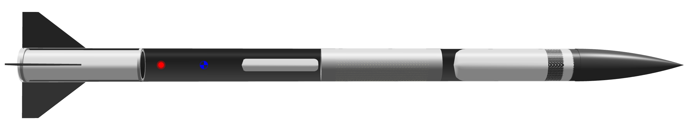

# crackle
## L2 High-Power Rocket Certification (L motors)

Crackle is a high-power rocket designed for Level 2 certification, featuring advanced avionics and dual-deployment recovery system.

## Specifications

| Parameter | Value |
|-----------|-------|
| Motor | AeroTech J460T |
| Max Velocity | Mach 1.24 |
| Predicted Apogee | 1995m |
| Length | 1329mm |
| Diameter | 66.8mm |
| Launch Weight | 1674g |
| Rail Size | [rail size] |
| CG Location | 980mm |
| CP Location | 1063mm |
| Stability | 1.25cal |

## Key Features

### Avionics Bay
- Primary Flight Computer: [model]
- Backup Flight Computer: [model]
- GPS Module: [model]
- IMU Sensors: [models]
- Power: [battery specs]
- Data Storage: [storage specs]

### Recovery System
- Drogue Deployment: apogee (1964m), electronically triggered (bp charge failsafe)
- Main Deployment: 300m, electronically triggered via barometer
- Drogue Chute: [size]" diameter
- Main Chute: [size]" diameter, 4000mm shock cord 
- Recovery Hardware: [hardware specs]

## Build Notes
- Airframe Material: Phenolic
- Fin Material: Fiberglass
- Number of Fins: 4
- Nose Cone: Phenolic tangent ogive
- Rail Buttons: [type]

## Pre-flight Checklist
1. Avionics
   - [ ] Batteries charged and secured
   - [ ] GPS lock confirmed
   - [ ] IMU calibration completed
   - [ ] Data logging verified
   - [ ] Deployment charges tested

2. Recovery
   - [ ] Shock cord inspected
   - [ ] Parachutes packed and protected
   - [ ] E-matches secured
   - [ ] Charge wells loaded
   - [ ] Deployment bay sealed

## Flight Log
| Date | Location | Weather | Flight Performance | Notes |
|------|-----------|---------|-------------------|--------|
| [date] | [location] | [conditions] | [performance] | [notes] |

## Resources
Rocket design wrap (from Lawton): https://alwanwraps.com/

## Contact
Designer: Lundeen Cahilly

NAR/TRA Number: 121847

Email: lcahilly@stanford.edu
